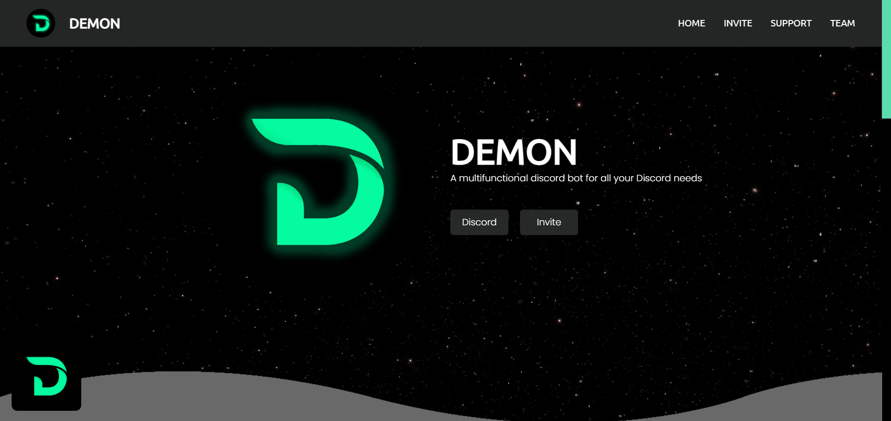

# DEMON Bot Website

Welcome to the official website for **DEMON** Discord Bot! This site is designed to provide comprehensive information about the bot and its development team.

- 

## Overview

**DEMON** is a multifunctional Discord bot that offers a range of features, including:

- **Anime Stats**: Get the latest updates and information about your favorite anime.
- **Image Manipulation**: Customize and modify images with ease.
- **Moderation Tools**: Manage your server with advanced moderation features.
- **Fun and Games**: Engage with fun commands and interactive games.
- **Giveaways**: Host and participate in exciting giveaways.

## Meet the Team

### FragNite
- **Role**: Main Developer
- **Description**: Arya, known as FragNite, is the lead developer behind DEMON. Responsible for the core functionalities and overall development of the bot.
- [Website](https://fragnite.vercel.app)

### Prasadⁿᶻ#0068
- **Role**: Documentation
- **Description**: Prasad manages the bot's documentation, ensuring users have the information they need to effectively use DEMON.
- [Website](https://itzzneo13.github.io)

## Invitation

- **Add DEMON to Your Server**: [Click here to invite DEMON](https://bit.ly/demonbotop)

## Contact

For support or more information, join our [support server](https://discord.gg/5MredjDjed).

## License

© 2020-2022 DEMON. All rights reserved. This website is created and maintained by FragNite.

